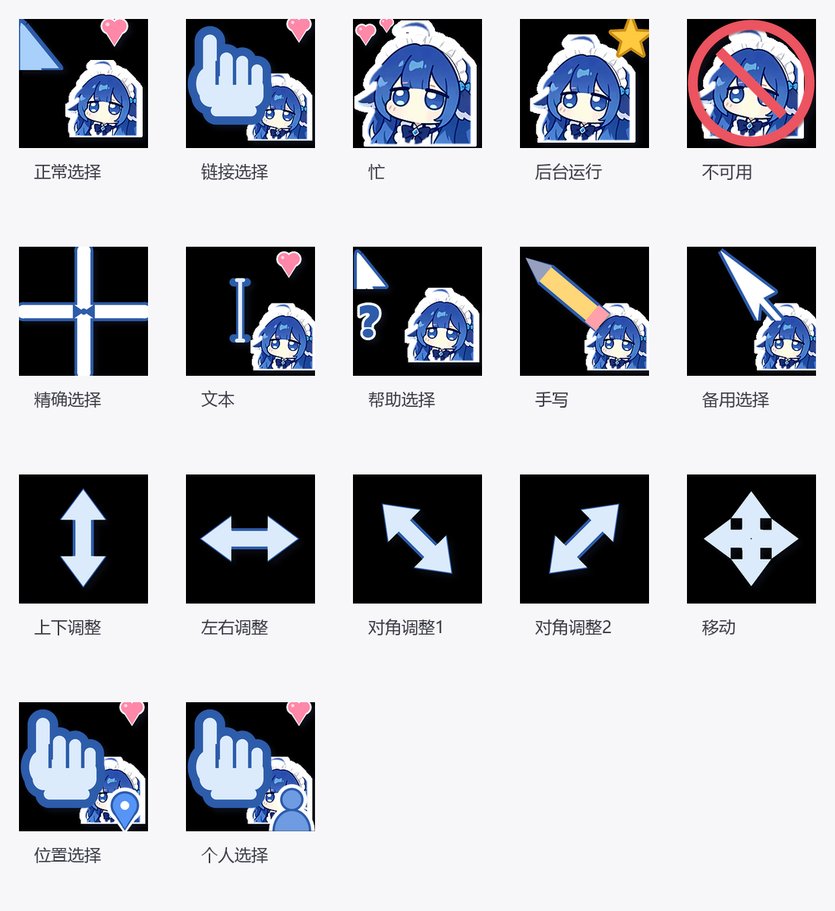

# MoeCursor · 娘化角色鼠标指针套装

一套 17 个的 Windows 鼠标指针，把 [DeepSeek 娘](https://linux.do) 做成贴纸风格光标：
白色贴纸描边 + 深蓝勾线 + 粉色小爱心点缀，完整覆盖 Win11 全部指针角色（含位置/个人选择）。

## 内容（17 个）

| 文件 | 角色 | 文件 | 角色 |
|---|---|---|---|
| moe_arrow.cur | 正常选择 | moe_hand.cur | 链接选择 |
| moe_help.cur | 帮助选择 | moe_busy.cur | 忙 |
| moe_appstart.cur | 后台运行 | moe_no.cur | 不可用 |
| moe_cross.cur | 精确选择 | moe_ibeam.cur | 文本选择 |
| moe_pen.cur | 手写 | moe_up.cur | 备用选择 |
| moe_sizens.cur | 上下调整 | moe_sizewe.cur | 左右调整 |
| moe_sizenwse.cur | 对角调整1 | moe_sizenesw.cur | 对角调整2 |
| moe_sizeall.cur | 移动 | moe_pin.cur | 位置选择 |
| moe_person.cur | 个人选择 | | |

每个文件内置 32–256px 多档尺寸（32 位透明），热点已按原生习惯设定。

## 安装

1. 右键 `安装鼠标指针.inf` → **安装**
2. `Win+R` 输入 `main.cpl` 回车 →「指针」选项卡 → 方案选 **MoeCursor** → 确定

调大小：设置 → 辅助功能 → 鼠标指针和触控 →「大小」滑块。
恢复默认：同一界面选「Windows 默认（系统方案）」。

## 自己改

`build_v4.py` 是全部生成逻辑（Python + OpenCV/PIL），改颜色/浓度/形状后重跑即可。
